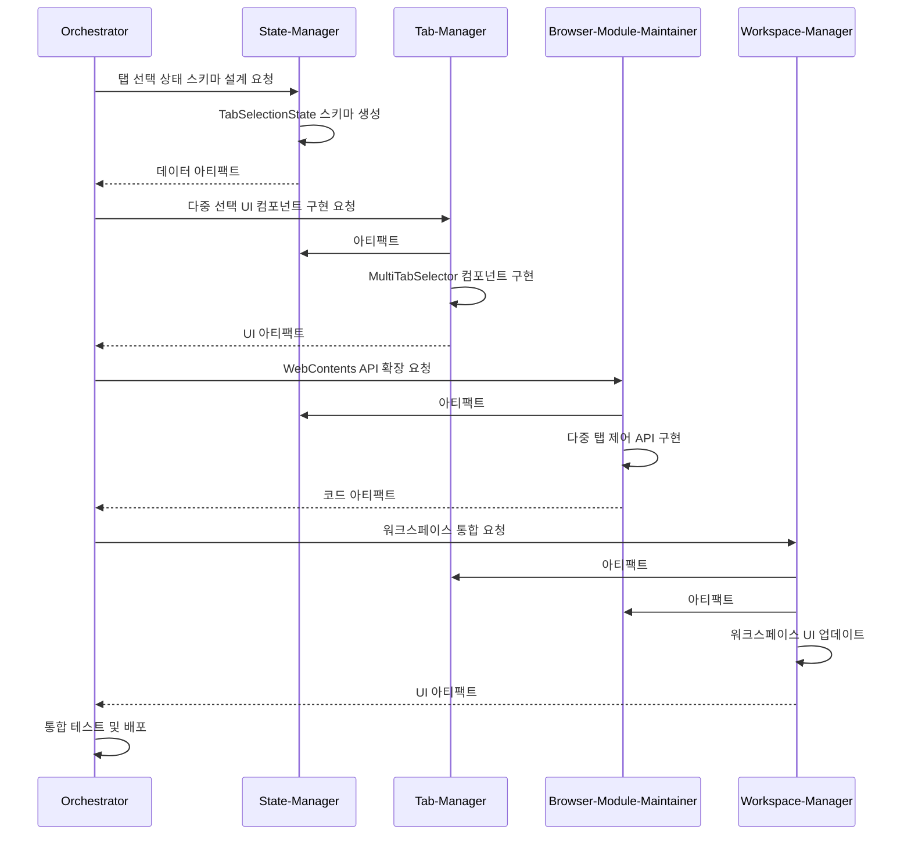

# 📦 Agent Artifacts System - Multi-Agent Communication Protocol

## 아티팩트 기반 통신 시스템 개요

EG-Desk:Taehwa 다중 에이전트 시스템에서 에이전트들은 **아티팩트(Artifacts)**를 통해 서로 소통합니다. 이는 대화 히스토리를 통한 정보 전달 대신, 구조화된 데이터 객체를 공유하여 효율적이고 정확한 협업을 가능하게 합니다.

## 아티팩트 타입 정의

### 📁 코드 아티팩트 (Code Artifacts)
```json
{
  "type": "code",
  "id": "artifact-001",
  "agent": "browser-module-maintainer",
  "timestamp": "2024-01-15T10:30:00Z",
  "file_path": "src/renderer/modules/browser-control/WebContentsManager.js",
  "changes": {
    "added": ["createMultipleTab()", "getSelectedTabs()"],
    "modified": ["switchTab()", "closeTab()"],
    "removed": []
  },
  "dependencies": {
    "requires": ["tab-manager:TabState"],
    "provides": ["WebContentsAPI"]
  },
  "test_coverage": {
    "unit_tests": ["WebContentsManager.test.js"],
    "integration_tests": ["browser-integration.test.js"],
    "coverage_percentage": 85
  },
  "performance_impact": {
    "memory_usage": "+2MB",
    "cpu_usage": "+5%",
    "load_time": "+0.2s"
  }
}
```

### 🎨 UI 아티팩트 (UI Artifacts)
```json
{
  "type": "ui",
  "id": "artifact-002", 
  "agent": "workspace-manager",
  "timestamp": "2024-01-15T11:15:00Z",
  "component": {
    "name": "MultiTabSelector",
    "path": "src/renderer/components/MultiTabSelector.jsx",
    "props": {
      "selectedTabs": "Array<string>",
      "onSelectionChange": "Function",
      "maxSelection": "number"
    }
  },
  "styling": {
    "theme_support": ["dark", "light"],
    "responsive": true,
    "accessibility": {
      "wcag_level": "AA",
      "screen_reader": true,
      "keyboard_navigation": true
    }
  },
  "user_interactions": {
    "click": "단일 탭 선택",
    "ctrl_click": "다중 탭 선택/해제",
    "shift_click": "범위 선택",
    "right_click": "컨텍스트 메뉴"
  }
}
```

### 📊 데이터 아티팩트 (Data Artifacts)
```json
{
  "type": "data",
  "id": "artifact-003",
  "agent": "state-manager", 
  "timestamp": "2024-01-15T12:00:00Z",
  "schema": {
    "name": "TabSelectionState",
    "structure": {
      "selectedTabIds": "Array<string>",
      "selectionMode": "single | multiple | range",
      "lastSelectedId": "string | null",
      "selectionCount": "number"
    }
  },
  "events": {
    "TAB_SELECTED": "탭 선택 시 발생",
    "TAB_DESELECTED": "탭 선택 해제 시 발생", 
    "SELECTION_CLEARED": "모든 선택 해제 시 발생"
  },
  "persistence": {
    "storage_key": "tab_selection_state",
    "auto_save": true,
    "restore_on_startup": false
  }
}
```

### 🔧 설정 아티팩트 (Configuration Artifacts)
```json
{
  "type": "configuration",
  "id": "artifact-004",
  "agent": "orchestrator",
  "timestamp": "2024-01-15T13:30:00Z",
  "build_config": {
    "webpack_changes": ["added multi-tab bundle splitting"],
    "electron_config": ["increased max_browser_windows to 10"],
    "package_updates": ["electron ^28.0.0 -> ^28.1.0"]
  },
  "environment": {
    "development": {
      "debug_multi_tab": true,
      "performance_monitoring": true
    },
    "production": {
      "tab_memory_limit": "100MB",
      "max_concurrent_tabs": 8
    }
  }
}
```

## 아티팩트 생성 및 관리 프로토콜

### 아티팩트 생성 규칙
```javascript
// 각 에이전트가 구현해야 할 아티팩트 인터페이스
class AgentArtifactManager {
  constructor(agentName) {
    this.agentName = agentName;
    this.artifacts = new Map();
  }

  createArtifact(type, data) {
    const artifact = {
      type,
      id: this.generateId(),
      agent: this.agentName,
      timestamp: new Date().toISOString(),
      ...data
    };
    
    this.artifacts.set(artifact.id, artifact);
    this.notifyOtherAgents(artifact);
    return artifact.id;
  }

  getArtifact(id) {
    return this.artifacts.get(id);
  }

  updateArtifact(id, updates) {
    const artifact = this.artifacts.get(id);
    if (artifact) {
      Object.assign(artifact, updates);
      artifact.timestamp = new Date().toISOString();
      this.notifyOtherAgents(artifact);
    }
  }
}
```

### 아티팩트 참조 시스템
```javascript
// 에이전트 간 아티팩트 참조 예시
class TabManager {
  async implementMultiSelection() {
    // state-manager가 생성한 데이터 스키마 참조
    const stateSchema = await this.getArtifact('state-manager', 'TabSelectionState');
    
    // browser-module-maintainer가 제공하는 API 참조
    const browserAPI = await this.getArtifact('browser-module-maintainer', 'WebContentsAPI');
    
    // 자신의 UI 아티팩트 생성
    const uiArtifact = this.createArtifact('ui', {
      component: {
        name: 'TabSelector',
        dependencies: [stateSchema.id, browserAPI.id]
      }
    });
    
    return uiArtifact;
  }
}
```

## 아티팩트 품질 검증

### 자동 검증 체크리스트
```markdown
**코드 아티팩트 검증**
- [ ] ESLint 규칙 통과
- [ ] 타입 검사 통과 (TypeScript/JSDoc)
- [ ] 단위 테스트 커버리지 80% 이상
- [ ] 성능 임계값 준수 (메모리, CPU)
- [ ] 보안 취약점 스캔 통과

**UI 아티팩트 검증**
- [ ] 접근성 기준 준수 (WCAG 2.1 AA)
- [ ] 반응형 디자인 테스트 통과
- [ ] 브라우저 호환성 확인
- [ ] 사용자 인터랙션 시나리오 테스트
- [ ] 시각적 회귀 테스트 통과

**데이터 아티팩트 검증**
- [ ] 스키마 유효성 검증
- [ ] 데이터 마이그레이션 경로 정의
- [ ] 성능 벤치마크 기준 충족
- [ ] 메모리 누수 검사 통과
- [ ] 동시성 안전성 확인
```

## 아티팩트 기반 워크플로우 예시

### 시나리오: 브라우저 탭 다중 선택 기능 구현



## 아티팩트 저장소 구조

```
.artifacts/
├── code/
│   ├── 2024-01-15/
│   │   ├── browser-module-maintainer/
│   │   │   ├── artifact-001.json
│   │   │   └── webcontents-api.patch
│   │   └── tab-manager/
│   │       ├── artifact-002.json
│   │       └── multi-selector.component.js
├── ui/
│   ├── components/
│   │   ├── MultiTabSelector/
│   │   │   ├── artifact-002.json
│   │   │   ├── component.jsx
│   │   │   ├── styles.css
│   │   │   └── screenshot.png
├── data/
│   ├── schemas/
│   │   ├── TabSelectionState/
│   │   │   ├── artifact-003.json
│   │   │   ├── schema.json
│   │   │   └── migration.sql
└── config/
    ├── build/
    │   ├── artifact-004.json
    │   ├── webpack.config.js
    │   └── electron.config.js
```

## 성과 추적 및 분석

### 아티팩트 메트릭
```javascript
// 아티팩트 품질 점수 계산
class ArtifactQualityAnalyzer {
  calculateQualityScore(artifact) {
    const scores = {
      completeness: this.checkCompleteness(artifact),      // 필수 필드 완성도
      consistency: this.checkConsistency(artifact),        // 다른 아티팩트와 일관성
      testability: this.checkTestability(artifact),        // 테스트 가능성
      performance: this.checkPerformance(artifact),        // 성능 영향도
      maintainability: this.checkMaintainability(artifact) // 유지보수성
    };
    
    return Object.values(scores).reduce((sum, score) => sum + score, 0) / 5;
  }
}

// 협업 효율성 측정
class CollaborationAnalyzer {
  analyzeAgentEfficiency() {
    return {
      artifact_creation_time: '평균 15분',
      artifact_integration_success_rate: '94%',
      dependency_conflict_rate: '2%',
      quality_score_average: 87.5
    };
  }
}
```

---

**아티팩트 시스템 목표**: *정확한 정보 전달, 효율적인 협업, 높은 품질 유지* 🎯

이 시스템을 통해 각 에이전트는 자신의 작업 결과를 명확하고 구조화된 형태로 다른 에이전트들과 공유할 수 있으며, 전체 프로젝트의 일관성과 품질을 유지할 수 있습니다.